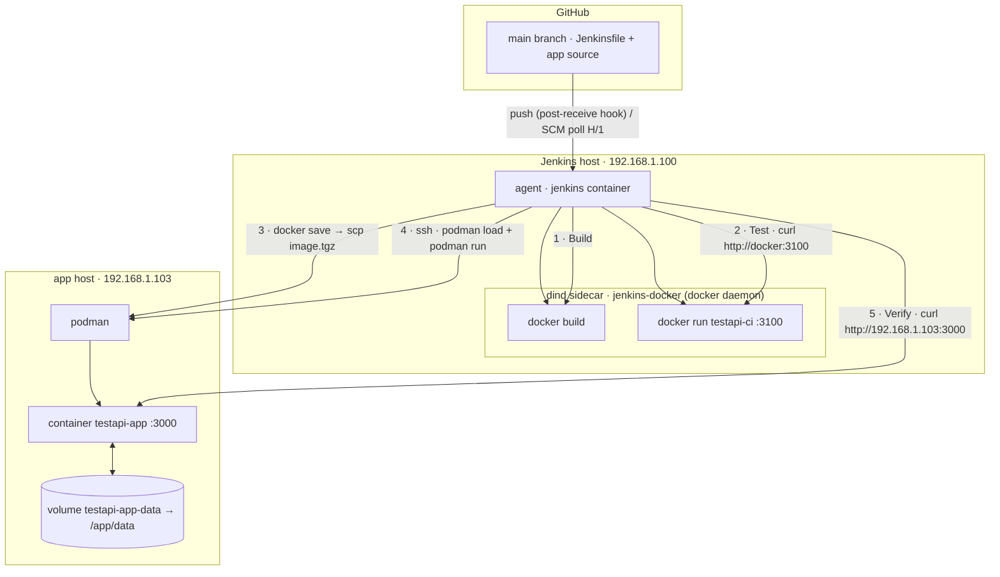

# CI/CD (Jenkins)

How `testapi-app` is built, tested, and deployed automatically.

Push to `main` → Jenkins builds the image, smoke-tests it, ships it to the
podman host, and verifies the live app. No manual steps required.

## Infrastructure

| Piece | Where | Role |
|-------|-------|------|
| GitHub | `github.com/mcropsey/testapi-app` | Source of truth, `main` branch |
| Jenkins | `192.168.1.100:8080` | Runs the pipeline (job `testapi-app`) |
| dind sidecar | `jenkins-docker` on `192.168.1.100` | Docker daemon the agent builds/runs against (`DOCKER_HOST=tcp://docker:2376`) |
| App host | `192.168.1.103` | Runs the app with **podman** |
| Data volume | `testapi-app-data` on `192.168.1.103` | Persists `users.json` across deploys |

- The Jenkins agent (the `jenkins` container) talks to the **dind** daemon, not
  the host daemon, for all `docker build`/`docker run`/`docker save` steps.
- The agent reaches the app host over **SSH** (`mcropsey@192.168.1.103`,
  key-based) for the deploy + verify steps.

## Flow



ASCII version:

```
  GitHub (main)
      |  push (dev box)  --post-push hook-->  (instant)
      |  SCM poll  H/1 * * * *  (fallback, ~1 min)
      v
  +----------------------------------------------------------+
  |  Jenkins host 192.168.1.100                              |
  |  agent (jenkins container)                               |
  |    1. Build   --docker build-->  [ dind daemon ]         |
  |    2. Test    --docker run :3100, curl--> [ dind daemon ]|
  |    3. Deploy  --docker save | scp image.tgz-->  \        |
  |    4.         --ssh: podman load + run-->   \            |
  +----------------------------------------------------------+  \
      |  5. Verify --curl http://192.168.1.103:3000          |
      v                                                       v
  +----------------------------------------------------------+
  |  app host 192.168.1.103                                  |
  |  podman -> container testapi-app :3000 <--> volume(data)  |
  +----------------------------------------------------------+
```

## Stages

### 1. Build
`git rev-parse --short HEAD` → tag. Then `docker build` in dind, producing:

- `testapi-app:<sha>`
- `testapi-app:latest`

### 2. Test
Runs the built image in dind (`docker run -d --rm --name testapi-ci -p 3100:3000`)
and smoke-tests the API at `http://docker:3100`:

- `GET /api/health`
- `POST /api/auth/login` (as `mike1`) → get a Bearer token
- `GET /api/users`
- `POST /api/users` (create `ci-smoke`)
- `DELETE /api/users/ci-smoke`

Any failure fails the pipeline before anything is deployed.

### DAST (Active scan)
Between Test and Deploy: starts the freshly built image on the agent
(`docker run -p 3000:3000`), waits for `/api/health`, then runs the Active
CLI scanner against it. The scanner runs with `--network=host`, so from its
point of view the app is at `http://localhost:3000` — the Active test group
(`TEST_GROUP_ID`, backend at `ACTIVE_API_URL`) must target that URL.

- `docker login` to the Active image registry
- `active-cli:<version>` is pulled from the registry; the version is resolved
  live from `$ACTIVE_API_URL/backend/version`
- Reports/config mount: workspace `akamai/` → container `/akamai`
- A non-zero scanner exit fails the pipeline before Deploy

**Job-config environment variables** (set in the Jenkins job configuration —
the repo is public, so the values must never live in the Jenkinsfile):

| Variable | Purpose |
|----------|---------|
| `ACTIVE_REGISTRY_URL` | Docker registry hosting `active-cli` |
| `ACTIVE_REGISTRY_USER` / `ACTIVE_REGISTRY_PASSWORD` | Registry login |
| `ACTIVE_API_URL` | Active backend API base URL |
| `ACTIVE_BACKEND_URI` | Active backend URI (passed to the scanner) |
| `CORE_CLI_CLIENT_ID` / `CORE_CLI_CLIENT_SECRET` | Scanner client credentials |
| `ENV_ID` | Active environment ID |
| `TEST_GROUP_ID` | Test group (defines the scan target) |

### 3. Deploy
- `docker tag testapi-app:<sha> localhost/testapi-app:<sha>`
- `docker save localhost/testapi-app:<sha> | gzip` → `image-<sha>.tgz`
- `scp` the tarball to the app host
- On the app host (over SSH):
  - `podman load < image-<sha>.tgz`
  - `podman tag localhost/testapi-app:<sha> localhost/testapi-app:latest`
  - `podman rm -f testapi-app`
  - `podman run -d --name testapi-app --restart unless-stopped -p 3000:3000 -v testapi-app-data:/app/data localhost/testapi-app:<sha>`

**Why the `localhost/` prefix?** `podman load` interprets a *bare* repository
name (`testapi-app`) as `docker.io/library/testapi-app`. The pipeline runs the
container as `localhost/testapi-app:<sha>` (podman's local-registry convention).
Tagging with `localhost/` before `docker save` makes the tarball carry that exact
name, so `podman load` restores `localhost/testapi-app:<sha>` and the container
starts without podman trying (and failing) to pull it from a registry.

### 4. Verify
From the Jenkins agent, curl the live app at `http://192.168.1.103:3000`:

- `GET /api/health`
- `POST /api/auth/login`

Both must succeed for the pipeline to report success.

## Data persistence

The `testapi-app-data` volume is **not** recreated on deploy — only the image and
container are replaced. So seeded/created users survive every deploy. Reset to the
defaults only by explicitly removing the volume (see `INSTALL.md`).

## Triggering

Push to `main` and the build starts:

- **Push from the dev box (192.168.1.103)** — instant. A git `post-push` hook
  (`~/testapi-app/.git/hooks/post-push`) POSTs to the job's `/build` endpoint
  right after the push succeeds. It reads
  `~/.jenkins-testapi-app.env` (Jenkins URL/user/password/job; not in the repo).
  (GitHub-side pushes can't reach the hook — that's what the poll is for.)
- **Push from anywhere else** — within ~1–2 min. The Jenkinsfile carries
  `pollSCM('H/1 * * * *')` as the fallback (it is the single source of truth for
  the trigger; it overrides anything set in the job UI config).

Manual triggers still work:

- UI: `http://192.168.1.100:8080/job/testapi-app/` → **Build now**
- API: crumb + session, then `POST /job/testapi-app/build` (see "Trigger a deploy")

## Day-to-day operations (no AI needed)

Everything below is plain shell/browser — nothing here is AI-specific.

### Log in to Jenkins

- URL: `http://192.168.1.100:8080`
- Username: `admin`
- Password: the one you set when Jenkins was first configured. (It is
  **not** stored in this repo — the repo is public, so keep all credentials
  out of it.) If you lose it, reset it on the Jenkins host `192.168.1.100`
  (try the one-time `docker exec jenkins cat /var/jenkins_home/secrets/initialAdminPassword`
  first; if already consumed, reset the `admin` user under
  *Manage Jenkins → Security → Users*, or recreate the account).

### Trigger a deploy

```bash
# normal path: just push
git push origin main

# or immediately, via the API (Jenkins requires a crumb + cookie session):
B=http://192.168.1.100:8080; U=admin; P=<your-jenkins-password>
CRUMB=$(curl -s -u "$U:$P" -c /tmp/jk.txt "$B/crumbIssuer/api/json" | sed 's/.*"crumb":"\([^"]*\)".*/\1/')
curl -s -u "$U:$P" -b /tmp/jk.txt -H "Jenkins-Crumb: $CRUMB" -X POST "$B/job/testapi-app/build" -w 'HTTP %{http_code}\n'   # 201 = queued
```

### Check the result

```bash
B=http://192.168.1.100:8080; U=admin; P=<your-jenkins-password>
# latest build number + result
curl -s -u "$U:$P" "$B/job/testapi-app/lastBuild/api/json?tree=number,building,result"
# full log of build #5
curl -s -u "$U:$P" "$B/job/testapi-app/5/logText/progressiveText?start=0"
```

Or in the UI: open the job → click the build number → *Console Output*.

### Check the running app (on the app host or from anywhere on the LAN)

```bash
curl -s http://192.168.1.103:3000/api/health
# which image is actually running
ssh mcropsey@192.168.1.103 'podman ps --filter name=testapi-app --format "{{.Image}}  {{.Status}}"'
# follow the app logs
ssh mcropsey@192.168.1.103 'podman logs -f testapi-app'
```

### Roll back to a previous version

Old images are **kept** on the app host (the pipeline never prunes them), so a
rollback is just "run the old image again". Your user data is in the volume, so
it is not affected:

```bash
ssh mcropsey@192.168.1.103 '
  podman images testapi-app                      # list available <sha> tags
  OLD=<sha>
  podman tag localhost/testapi-app:$OLD localhost/testapi-app:latest
  podman rm -f testapi-app
  podman run -d --name testapi-app --restart unless-stopped \
    -p 3000:3000 -v testapi-app-data:/app/data localhost/testapi-app:$OLD
'
```

The next pipeline build will simply replace it again with the newer version.

## Manual (no Jenkins)

To build/run without the pipeline, see `INSTALL.md` (`make run`, `make test`).

## Troubleshooting

| Symptom | Likely cause / fix |
|---------|--------------------|
| `podman run ... Trying to pull ... connection refused` | Image name mismatch. Ensure the deploy tags `localhost/...` before `docker save` (see stage 3). |
| Build fails to compile the `Jenkinsfile` | Groovy escaping. In single-quoted Groovy strings, a backslash before `(` must be `\\(`, not `\(`. |
| `docker save` produces an empty/tiny tarball | The save and the `scp` must run in the **same** container context (both in the agent), otherwise you ship a stale file. |
| Deploy works but data is gone | The `testapi-app-data` volume was removed. Recreate it or re-seed. |
