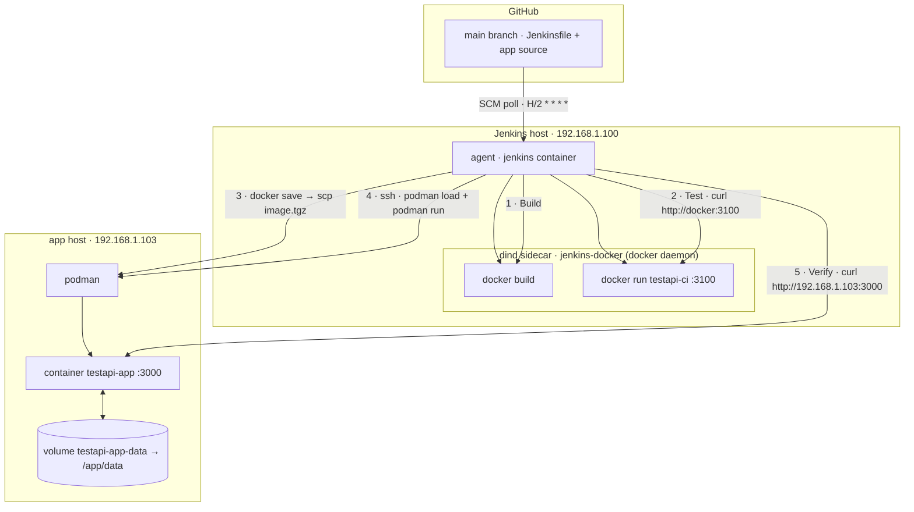

# CI/CD (Jenkins)

How `testapi-app` is built, tested, and deployed automatically.

Push to `main` → Jenkins builds the image, smoke-tests it, ships it to the
podman host, and verifies the live app. No manual steps required.

## Infrastructure

| Piece | Where | Role |
|-------|-------|------|
| GitHub | `github.com/mcropsey/testapi-app` | Source of truth, `main` branch |
| Jenkins | `192.168.1.100:8080` | Runs the pipeline (job `testapi-app`) |
| dind sidecar | `jenkins-docker` on `192.168.1.100` | Docker daemon the agent builds/runs against (`DOCKER_HOST=tcp://docker:2376`) |
| App host | `192.168.1.103` | Runs the app with **podman** |
| Data volume | `testapi-app-data` on `192.168.1.103` | Persists `users.json` across deploys |

- The Jenkins agent (the `jenkins` container) talks to the **dind** daemon, not
  the host daemon, for all `docker build`/`docker run`/`docker save` steps.
- The agent reaches the app host over **SSH** (`mcropsey@192.168.1.103`,
  key-based) for the deploy + verify steps.

## Flow



ASCII version:

```
  GitHub (main)
      |  SCM poll  H/2 * * * *
      v
  +----------------------------------------------------------+
  |  Jenkins host 192.168.1.100                              |
  |  agent (jenkins container)                               |
  |    1. Build   --docker build-->  [ dind daemon ]         |
  |    2. Test    --docker run :3100, curl--> [ dind daemon ]|
  |    3. Deploy  --docker save | scp image.tgz-->  \        |
  |    4.         --ssh: podman load + run-->   \            |
  +----------------------------------------------------------+  \
      |  5. Verify --curl http://192.168.1.103:3000          |
      v                                                       v
  +----------------------------------------------------------+
  |  app host 192.168.1.103                                  |
  |  podman -> container testapi-app :3000 <--> volume(data)  |
  +----------------------------------------------------------+
```

## Stages

### 1. Build
`git rev-parse --short HEAD` → tag. Then `docker build` in dind, producing:

- `testapi-app:<sha>`
- `testapi-app:latest`

### 2. Test
Runs the built image in dind (`docker run -d --rm --name testapi-ci -p 3100:3000`)
and smoke-tests the API at `http://docker:3100`:

- `GET /api/health`
- `POST /api/auth/login` (as `mike1`) → get a Bearer token
- `GET /api/users`
- `POST /api/users` (create `ci-smoke`)
- `DELETE /api/users/ci-smoke`

Any failure fails the pipeline before anything is deployed.

### 3. Deploy
- `docker tag testapi-app:<sha> localhost/testapi-app:<sha>`
- `docker save localhost/testapi-app:<sha> | gzip` → `image-<sha>.tgz`
- `scp` the tarball to the app host
- On the app host (over SSH):
  - `podman load < image-<sha>.tgz`
  - `podman tag localhost/testapi-app:<sha> localhost/testapi-app:latest`
  - `podman rm -f testapi-app`
  - `podman run -d --name testapi-app --restart unless-stopped -p 3000:3000 -v testapi-app-data:/app/data localhost/testapi-app:<sha>`

**Why the `localhost/` prefix?** `podman load` interprets a *bare* repository
name (`testapi-app`) as `docker.io/library/testapi-app`. The pipeline runs the
container as `localhost/testapi-app:<sha>` (podman's local-registry convention).
Tagging with `localhost/` before `docker save` makes the tarball carry that exact
name, so `podman load` restores `localhost/testapi-app:<sha>` and the container
starts without podman trying (and failing) to pull it from a registry.

### 4. Verify
From the Jenkins agent, curl the live app at `http://192.168.1.103:3000`:

- `GET /api/health`
- `POST /api/auth/login`

Both must succeed for the pipeline to report success.

## Data persistence

The `testapi-app-data` volume is **not** recreated on deploy — only the image and
container are replaced. So seeded/created users survive every deploy. Reset to the
defaults only by explicitly removing the volume (see `INSTALL.md`).

## Triggering

The job is configured with an SCM poll (`H/2 * * * *`) on the `main` branch, so it
picks up pushes to `main` within ~30 minutes. You can also trigger immediately:

- UI: `http://192.168.1.100:8080/job/testapi-app/` → **Build now**
- API: `POST /job/testapi-app/build` (auth + crumb)

## Manual (no Jenkins)

To build/run without the pipeline, see `INSTALL.md` (`make run`, `make test`).

## Troubleshooting

| Symptom | Likely cause / fix |
|---------|--------------------|
| `podman run ... Trying to pull ... connection refused` | Image name mismatch. Ensure the deploy tags `localhost/...` before `docker save` (see stage 3). |
| Build fails to compile the `Jenkinsfile` | Groovy escaping. In single-quoted Groovy strings, a backslash before `(` must be `\\(`, not `\(`. |
| `docker save` produces an empty/tiny tarball | The save and the `scp` must run in the **same** container context (both in the agent), otherwise you ship a stale file. |
| Deploy works but data is gone | The `testapi-app-data` volume was removed. Recreate it or re-seed. |
